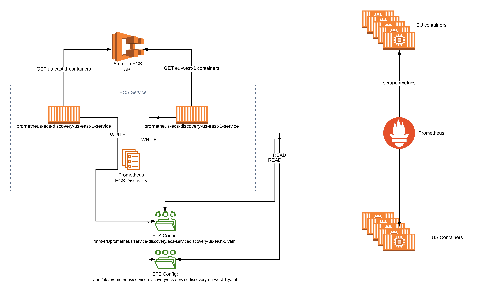

<!--
    Written in the format prescribed by https://github.com/Financial-Times/runbook.md.
    Any future edits should abide by this format.
-->
# Prometheus ECS Discovery

A service which runs on AWS ECS and collates a list of containers also running on AWS ECS so Prometheus can scrape them.
This allows us to automatically collect runtime metrics from our applications running on ECS and exposing Prometheus metrics on a `/metrics` endpoint.

## Code

prometheus-ecs-discovery

## Primary URL

N/A

## Service Tier

Platinum

## Lifecycle Stage

Production

## Host Platform

AWS ECS

## Architecture

Diagram for the exporter:



[View in Lucidchart](https://www.lucidchart.com/invitations/accept/3ef3819f-ff35-4f3f-a393-eecd21ea0d15).

## Contains Personal Data

No

## Contains Sensitive Data

No

## Failover Architecture Type

ActiveActive

## Failover Process Type

FullyAutomated

## Failback Process Type

FullyAutomated

## Failover Details

Writes configuration to a AWS EFS files in a single region. Cross-region is not applicable.

## Data Recovery Process Type

NotApplicable

## Data Recovery Details

Not applicable.

## Release Process Type

FullyAutomated

## Rollback Process Type

Manual

## Release Details

Release:

*   Merge a commit to master
*   [CircleCI](https://circleci.com/gh/Financial-Times/workflows/prometheus-ecs-discovery) will build and deploy the commit.

Rollback:

*   Open CircleCI for this project: [circleci:prometheus-ecs-discovery](https://circleci.com/gh/Financial-Times/workflows/prometheus-ecs-discovery)
*   Find the build of the commit which you wish to roll back to. The commit message is visible, and the `sha` of the commit is displayed to the right
*   Click on `Rerun`, under the build status for each workflow
*   Click `Rerun from beginning`

## Key Management Process Type

Manual

## Key Management Details

The systems secrets are set at build time as parameters in the services Cloudformation template.

They come from two sources:

1.  The CircleCI environment variables for the CircleCI project.
2.  The CircleCI context used in the [CircleCI config](https://github.com/Financial-Times/prometheus-ecs-discovery/blob/master/.circleci/config.yml).

See the [README](https://github.com/Financial-Times/prometheus-ecs-discovery#prometheus-amazon-ecs-discovery) for more details.

## First Line Troubleshooting

It may be useful to view the latest targets Prometheus has read from the written config file using the targets interface for the [EU](https://prometheus-eu-west-1.in.ft.com/targets#job-application) and [US](https://prometheus-us-east-1.in.ft.com/targets#job-application) prometheus instances. If this list does not contain any instances, or does not contain the expected instance, it is likely there is an issue with the running of the ECS discovery service, or accessing the ECS API in a given region.

AWS credentials are obtained using an ECS task role and so should not require keys or require human intervention due to expiry.

View the generic troubleshooting information for the AWS ECS cluster (including services running on the cluster) which the application runs on: [monitoring-aggregation-ecs](https://github.com/Financial-Times/monitoring-aggregation-ecs/blob/master/documentation/RUNBOOK.md).

## Second Line Troubleshooting

The service discovery component runs two containers per task: each collects service discovery information for a particular region. These are written to separate files.

## Monitoring

The Heimdall Prometheus has some bespoke alarms which are sent to the [#rel-eng-alerts](https://financialtimes.slack.com/messages/C8QL0GY9J) Slack via alertmanager.

These are visible in the [Alertmanager UI](https://alertmanager.in.ft.com/) if they are firing.

There are several Grafana dashboards:

*   [AWS ECS Task metrics](http://grafana.ft.com/d/YCsaeAFiz/aws-ecs-operations-and-reliability?orgId=1&var-region=eu-west-1&var-cluster=mon-agg-ecs&var-service=mon-agg-ecs-service-prometheus-ecs-discovery-Service-1OY1CGBRU4NXW) (`us-east-1` metrics are available using the dropdowns).
*   [Go language runtime metrics](http://grafana.ft.com/d/c0mUzOcmz/go-processes?orgId=1&var-system=prometheus-ecs-discovery-exporter&var-cluster_name=All&var-container=prometheus-ecs-discovery-exporter-service&var-task_revision=All&var-instance=All&var-interval=10m) - note: this dashboard is based on metrics from containers discovered using this service, and may indicate what targets are available.

Logs are available in [Splunk](https://financialtimes.splunkcloud.com/en-GB/app/search/search?q=search%20index%3D%22operations-reliability%22%20attrs.com.ft.service-name%3D%22prometheus-ecs-discovery*%22%20attrs.com.ft.service-region%3D%22*%22&display.page.search.mode=verbose&dispatch.sample_ratio=1&earliest=-1h&latest=now) via the query:

```splunk
index="operations-reliability" attrs.com.ft.service-name="prometheus-ecs-discovery-*-service" attrs.com.ft.service-region="*"
```

the `source` parameter can be specified more exactly to include only relevant component if needed.